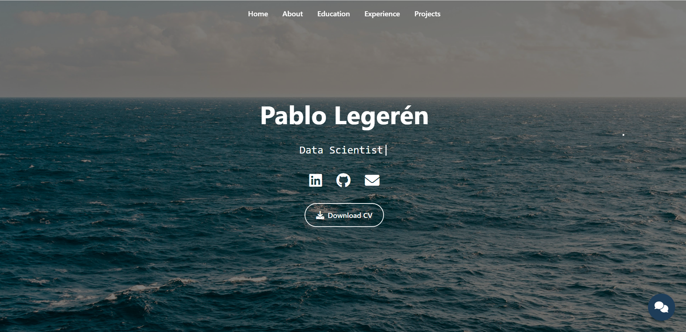

# Personal Portfolio – Pablo Legerén

Welcome to my personal portfolio! This repository hosts my professional website, built with modern web technologies and deployed via GitHub Pages. It showcases my projects, skills, and experience in an interactive and responsive format.

## Live Website

👉 [pablo-legeren.github.io/portfolio](https://pablo-legeren.github.io/portfolio)

## Preview

  

## Technologies Used

- **HTML** – Semantic structure of the website  
- **CSS** – Custom styling and responsive design  
- **JavaScript** – Dynamic interactions and functionality  
- **GitHub Pages** – Free static site hosting
